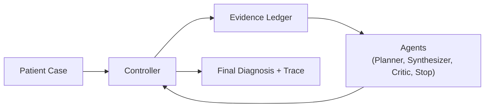
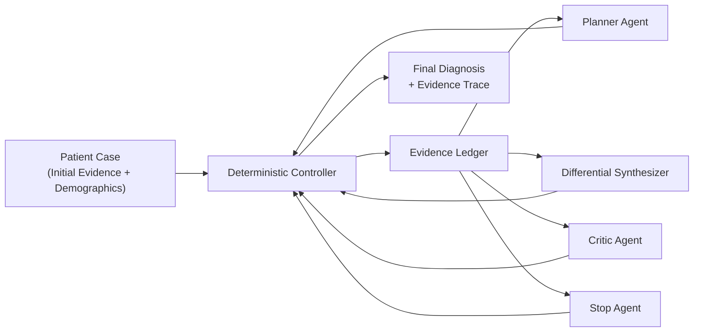

# Simple Multi-Agent Architecture Diagram

This is the simplified meeting-ready version of the architecture.

## One-Line Explanation

The controller manages the workflow, all agents read from and write to the shared evidence ledger, and the final diagnosis is produced only after ledger-guided coordination.

## Slightly Expanded Version

