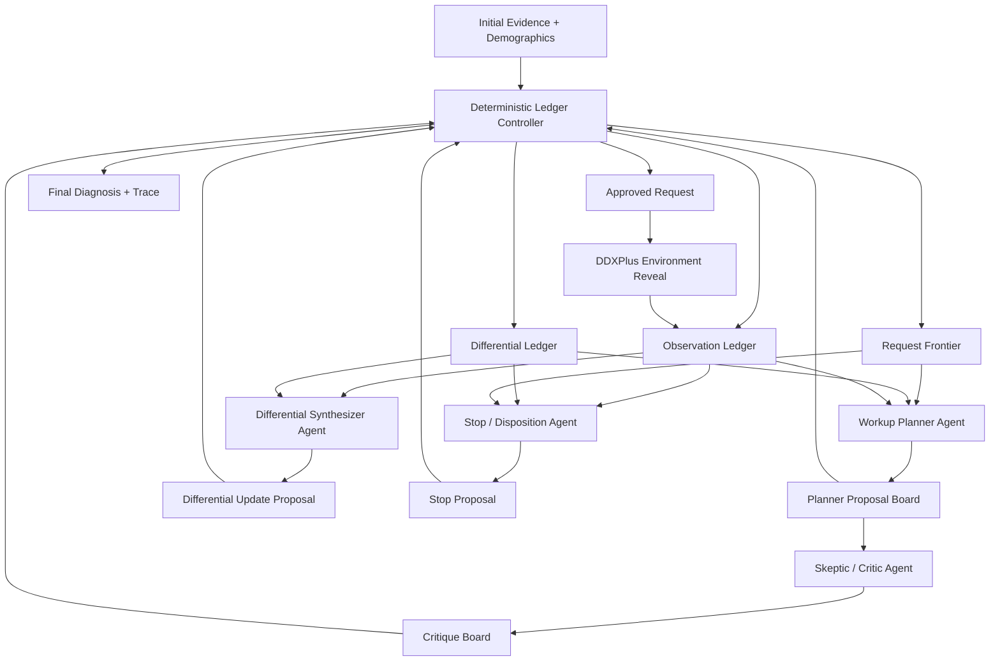
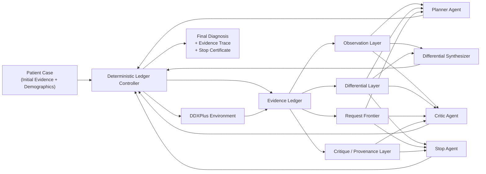
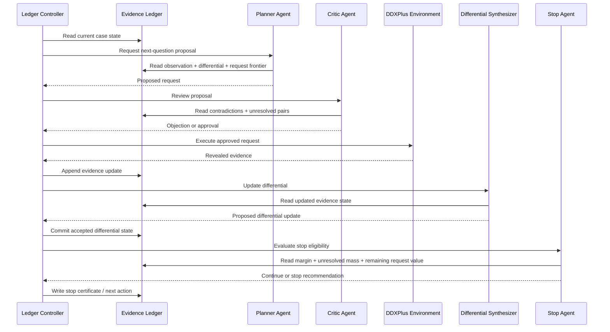

# Proposed Multi-Agent Architecture For DDXPlus Diagnostic Workup

## Goal

This report proposes a concrete multi-agent architecture for the next stage of the project.

The design goal is not merely to add more agents. It is to convert the current refined single-agent sequential system into a **ledger-centered multi-agent diagnostic workup system** where:

- all agents read from the same structured evidence ledger
- agents do not directly debate in free-form chat
- diagnosis progresses through validated ledger updates
- the controller activates agents based on the ledger state

This is the architecture I would show in an instructor meeting.

## Design Principle

The right abstraction is:

> agents are specialized knowledge sources; the ledger is the shared working memory; the controller chooses which agent acts next based on the current ledger state.

That is close to a blackboard architecture, but adapted to diagnosis.

## Why This Architecture Fits Your Project

Your project is already moving in this direction:

- notebook `05` already has anchored diagnosis state
- the shortlist is already ledger-driven
- legality and stopping are already partly deterministic

So the multi-agent version should not be a complete restart. It should extend the same control philosophy:

- from one policy + one controller
- to multiple specialized roles writing into the same diagnostic ledger

## Recommended Agent Roles

I recommend **five agents plus one deterministic controller**.

### 1. Workup Planner Agent

Responsibility:

- propose the next evidence request
- reason over the unresolved top differential
- prefer high-yield discriminators

Reads:

- active differential state
- request frontier
- unresolved diagnosis pairs
- prior request history

Writes:

- `proposed_request`
- short justification
- expected diagnostic separation

### 2. Differential Synthesizer Agent

Responsibility:

- update the ranked differential
- summarize support and contradiction for top diagnoses
- produce the current best diagnosis hypothesis

Reads:

- full revealed evidence ledger
- support / contradiction tables
- prior differential state

Writes:

- `proposed_differential_update`
- ranked top-k diagnoses
- supporting findings
- contradicting findings

### 3. Skeptic / Critic Agent

Responsibility:

- challenge overconfident diagnosis updates
- flag ignored contradictions
- reject generic or low-value requests
- prevent drift away from anchored evidence

Reads:

- planner proposal
- synthesizer proposal
- contradiction tables
- stop certificate

Writes:

- `objection`
- `risk_flag`
- `request_rejected_reason`
- `diagnosis_challenge`

### 4. Retrieval / Guideline Agent

Responsibility:

- optionally retrieve external medical knowledge, condition summaries, or structured priors
- support difficult cases where observed evidence alone is insufficient

Reads:

- current top differential
- unresolved evidence questions
- evidence pattern summaries

Writes:

- `retrieved_context`
- `guideline_snippets`
- `retrieval_confidence`

Important note:

- this agent should be optional
- for DDXPlus experiments, retrieval should be controlled carefully so you do not confound dataset reasoning with external knowledge

### 5. Stop / Disposition Agent

Responsibility:

- assess whether the case is diagnostically resolved
- determine whether another request is still justified

Reads:

- differential margin
- unresolved mass
- top request scores
- critic objections

Writes:

- `stop_recommendation`
- `stop_rationale`
- `remaining_uncertainty`

### 6. Deterministic Ledger Controller

This should **not** be just another free-form LLM agent.

Responsibility:

- enforce legality
- resolve conflicting proposals
- accept or reject ledger writes
- activate agents based on state triggers
- finalize stop decision

Reads:

- all proposed updates
- all objections
- request legality graph
- stop certificate thresholds

Writes:

- accepted ledger state
- current active phase
- final next action

This component is what stops the system from becoming a loose chatroom.

## Proposed Interaction Rule

The most important rule:

> agents do not communicate directly; they communicate only by writing structured claims to the ledger.

Why this matters:

- easier to audit
- easier to evaluate
- less prompt chaos
- clearer novelty claim
- much more clinically interpretable

## Ledger Regions

I recommend splitting the ledger into six regions.

### A. Observation Ledger

- revealed evidence
- absent evidence
- decoded values
- provenance

### B. Differential Ledger

- candidate diagnoses
- scores
- support evidence
- contradiction evidence
- unresolved competing pairs

### C. Request Frontier

- legal next questions
- shortlist scores
- expected utility
- genericness penalties

### D. Proposal Board

- pending planner proposals
- pending differential updates
- pending stop recommendations

### E. Critique Board

- objections
- unresolved contradictions
- drift alerts
- conflict markers

### F. Control Board

- current phase
- active agent
- stop certificate state
- accepted next action

## Interaction Loop

Here is the recommended control loop.

### Phase 0. Initialize

- compile the case into the ledger
- reveal demographics + initial evidence
- compute initial anchored differential

### Phase 1. Planner Proposal

- planner reads unresolved diagnosis pairs and request frontier
- planner proposes one next request

### Phase 2. Critic Review

- critic checks if the request is generic, redundant, or inconsistent
- critic either accepts silently or posts an objection

### Phase 3. Controller Resolve

- controller decides whether to approve the planner request
- if rejected, controller either selects the next-best request or forces stop evaluation

### Phase 4. Environment Reveal

- approved request is executed
- revealed evidence is written into the observation ledger

### Phase 5. Differential Update

- differential synthesizer updates support/contradiction state and ranked diagnoses

### Phase 6. Stop Evaluation

- stop agent proposes continue vs stop
- critic can object if contradictions remain unresolved
- controller finalizes

### Phase 7. Terminate Or Repeat

- if stop certificate satisfied: output final diagnosis
- otherwise return to planner phase

## Mermaid Diagram

## Presentation Diagram

This version is simpler and better for slides or an instructor walkthrough.

## Sequence Sketch

This sequence view shows how one workup turn proceeds.

## Why This Is Better Than A Generic Multi-Agent Setup

This architecture is stronger than “planner + critic + answerer” for two reasons.

### 1. It is diagnosis-specific

The shared state is not generic task memory. It is built around:

- evidence
- differential diagnosis
- unresolved discriminators
- stop eligibility

### 2. It is controller-constrained

Most generic multi-agent systems allow agents to exchange messages freely.

Here:

- agents submit typed proposals
- the controller enforces legality
- the ledger is the single source of truth

That gives you a more defendable algorithmic contribution.

## Recommended Architecture Variant For Your Project

For your next implementation stage, I recommend this exact variant:

- **Controller**: deterministic
- **Planner**: LLM
- **Differential Synthesizer**: LLM + deterministic score update
- **Critic**: LLM
- **Stop Agent**: deterministic-first, optional LLM explanation
- **Retriever**: optional, off by default in DDXPlus core experiments

Why:

- it keeps the core control reproducible
- it limits expensive agent chatter
- it makes ablation easier
- it matches your current notebook `05` philosophy

## Suggested Minimum Viable Multi-Agent Experiment

Do not begin with a large, fully general agent society.

Start with a narrow transition from notebook `05`:

1. split the current single-agent policy into:
   - planner
   - synthesizer
   - critic
2. keep the controller deterministic
3. keep the same fixed 49-case pilot
4. compare:
   - notebook `05` single-agent refined
   - multi-agent ledger controller with the same budgets

That gives you a fair next-stage comparison.

## Evaluation Questions For The Multi-Agent Stage

When you implement this, the main questions should be:

1. does multi-agent improve top-1 / top-3 / top-5 over refined single-agent?
2. does critic intervention reduce drift?
3. does the planner choose more discriminative questions?
4. does multi-agent improve stop quality?
5. what is the token cost overhead?

Without these, “more agents” will not be persuasive.

## Suggested Meeting Pitch

If you need a concise explanation for the instructor:

> Our multi-agent system is not a set of agents chatting freely. It is a ledger-centered blackboard architecture for diagnostic workup. A planner proposes evidence requests, a synthesizer updates the differential, a critic challenges weak or drifting claims, and a deterministic controller accepts only ledger-valid updates. The evidence ledger is therefore both the shared memory and the coordination algorithm.

That is concrete.

## Design Inspiration

This architecture is informed by a few relevant patterns, but adapted to your project’s diagnostic ledger idea.

- event-driven blackboard coordination in multi-agent systems: [IBM Research, 2005](https://research.ibm.com/publications/event-based-blackboard-architecture-for-multi-agent-systems)
- blackboard-based dynamic LLM MAS with controller + shared blackboard + role agents: [Exploring Advanced LLM Multi-Agent Systems Based on Blackboard Architecture](https://www.emergentmind.com/papers/2507.01701)
- medical multi-agent decomposition into specialized clinical reasoning roles: [A multi-agent approach to neurological clinical reasoning](https://journals.plos.org/digitalhealth/article?id=10.1371%2Fjournal.pdig.0001106)
- dynamic clinical orchestration with mutable working memory and backtracking: [ClinicalAgents](https://papers.cool/arxiv/2603.26182)

## Final Recommendation

For this project, the strongest next architecture is:

- **ledger-centered**
- **event-triggered**
- **controller-constrained**
- **differential-aware**
- **critic-enabled**

That gives you something concrete to show now, and something technically coherent to implement next.
